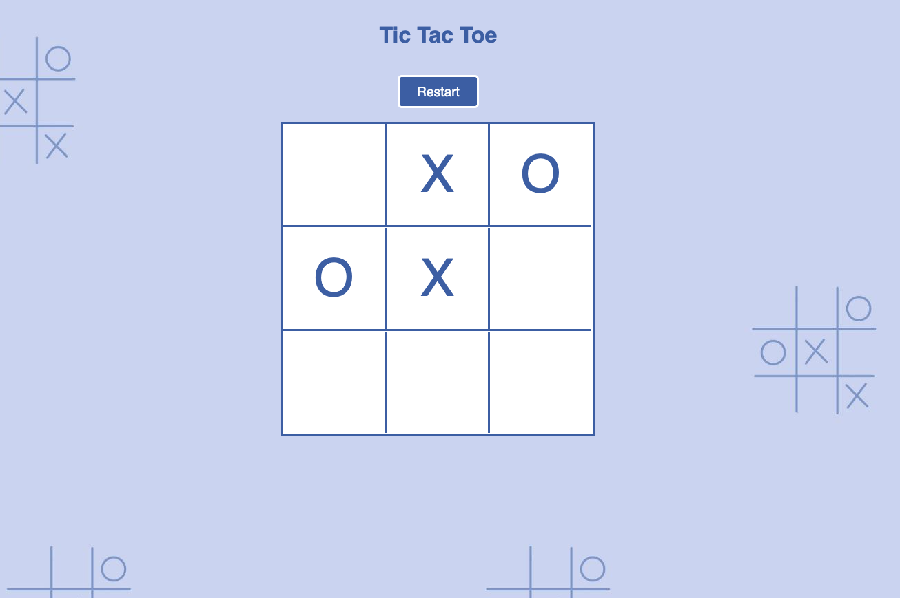

# LunaPlay Games

A modern games portal featuring three classic games built with React + Vite. Play Tic Tac Toe, Snake, and Connect 4 with beautiful UI and smooth gameplay.

## Live Demo

**[Play Now - lunaplay-games.netlify.app](https://lunaplay-games.netlify.app/)**

## Features

- **Three Classic Games**
  - **Tic Tac Toe** - Play against AI with smart algorithms
  - **Snake** - Classic arcade game with high score tracking
  - **Connect 4** - Strategic game with advanced minimax AI

- **Modern Design**
  - Responsive layout for all devices
  - Custom blue color scheme
  - Smooth animations and transitions
  - Poppins font for clean typography

- ** Fast Performance**
  - Built with React + Vite
  - Optimized production builds
  - Instant loading and smooth gameplay

## Tech Stack

- **Frontend**: React 19, JavaScript ES6+
- **Build Tool**: Vite
- **Styling**: CSS3 with custom properties
- **Games**: Vanilla JavaScript with Canvas API
- **Deployment**: Netlify
- **Font**: Google Fonts (Poppins)

## Screenshots

### Portal Homepage


### Games
| Tic Tac Toe | Snake | Connect 4 |
|-------------|-------|-----------|
|  |  |  |

## Quick Start

### Prerequisites
- Node.js 16+ 
- npm or yarn

### Installation

1. **Clone the repository**
```bash
git clone https://github.com/yourusername/lunaplay-games.git
cd lunaplay-games
```

2. **Install dependencies**
```bash
npm install
```

3. **Start development server**
```bash
npm run dev
```

4. **Open in browser**
```
http://localhost:5173
```

### Build for Production

```bash
npm run build
```

The built files will be in the `dist` folder, ready for deployment.

## Game Details

### Tic Tac Toe
**Tic Tac Toe**: [@annagornyitzki](https://github.com/annagornyitzki/tictactoe)
- **AI Opponent**: Smart random move selection
- **Responsive Design**: Works on all screen sizes
- **Auto Restart**: Games restart after completion
- **Visual Feedback**: Winning combinations highlighted

### Snake
**Snake**: [@annagornyitzki](https://github.com/annagornyitzki/snake)
- **Controls**: Arrow keys or WASD
- **High Score**: Persistent local storage
- **Game Over Screen**: Press Enter to restart
- **Responsive Canvas**: Scales with screen size

### Connect 4
**Connect 4**: [@annagornyitzki](https://github.com/annagornyitzki/connect4)
- **Advanced AI**: Minimax algorithm with alpha-beta pruning
- **Strategic Gameplay**: 4-depth lookahead for challenging AI
- **Visual Feedback**: Smooth piece dropping animations
- **Win Detection**: All directions (horizontal, vertical, diagonal)

## Project Structure

```
lunaplay-games/
├── public/
│   ├── games/
│   │   ├── tictactoe/
│   │   │   ├── index.html
│   │   │   ├── tictactoe.js
│   │   │   ├── tictactoe.css
│   │   │   └── tictactoe-background.jpg
│   │   ├── snake/
│   │   │   ├── index.html
│   │   │   ├── snake.js
│   │   │   ├── snake.css
│   │   │   └── snake-background4.jpg
│   │   └── connect4/
│   │       ├── index.html
│   │       ├── connect4.js
│   │       ├── connect4.css
│   │       └── connect4-background2.jpg
│   └── vite.svg
├── src/
│   ├── assets/
│   │   └── screenshots/
│   │       ├── tictactoe-gameplay.png
│   │       ├── snake-gameplay.png
│   │       └── connect4-gameplay.png
│   ├── App.jsx
│   ├── App.css
│   ├── index.css
│   └── main.jsx
├── index.html
├── package.json
├── vite.config.js
└── README.md
```

## Customization

### Colors
The main brand colors can be modified in [`src/index.css`](src/index.css) and [`src/App.css`](src/App.css):

```css
:root {
  --primary-blue: #063977;
  --secondary-blue: #0758ba;
  --background-blue: #7da3d1;
}
```

### Games
Each game is self-contained in the [`public/games`](public/games) directory and can be modified independently.

Look at these GitHub Repos to learn about each individual game:
**Snake**: [@annagornyitzki](https://github.com/annagornyitzki/snake)
**Tic Tac Toe**: [@annagornyitzki](https://github.com/annagornyitzki/tictactoe)
**Connect 4**: [@annagornyitzki](https://github.com/annagornyitzki/connect4)


## License

This project is licensed under the MIT License - see the [LICENSE](LICENSE) file for details.

## Contact

- **Website**: [lunaplay-games.netlify.app](https://lunaplay-games.netlify.app/)
- **GitHub**: [@annagornyitzki](https://github.com/annagornyitzki)

---

**Enjoy playing LunaPlay Games!**
